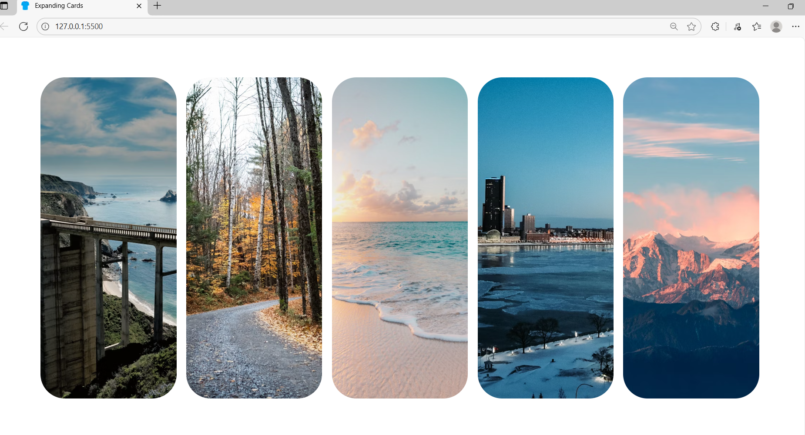
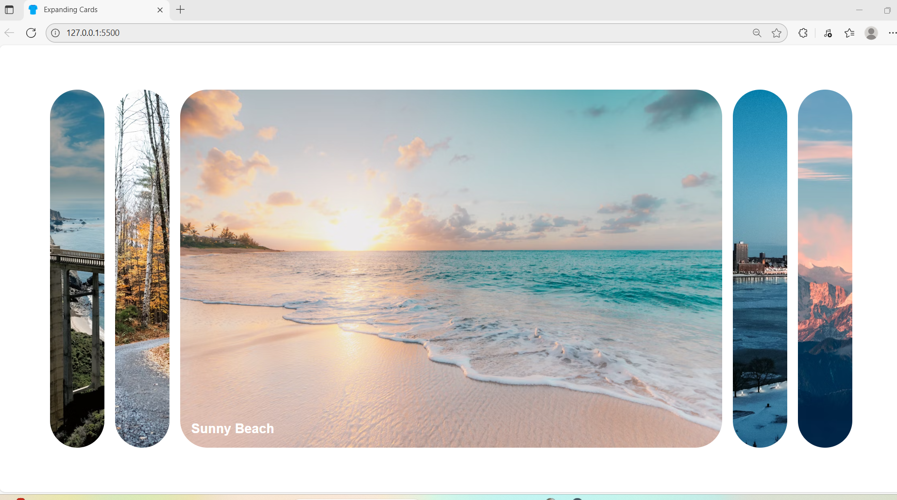

# 🌄 Expanding Cards

An interactive and visually appealing UI component where each card expands on click, revealing its title with a smooth transition effect. Built using **HTML**, **CSS**, and **JavaScript** — perfect for learning DOM manipulation, flexbox, and animation effects.

---

## 🚀 Features

- ✨ Smooth expanding animation on card click  
- 🖼️ Full-screen background images for each card  
- 🎭 Title fade-in animation when active  
- 📱 Responsive — hides extra cards on small screens  
- 🎯 Simple and clean UI with flexbox  

---

## 🧠 What I Learned

- Using **Flexbox** for layout alignment  
- Applying **CSS transitions** for smooth UI animations  
- Adding and removing classes using **JavaScript (classList)**  
- DOM event handling using `addEventListener`  
- Responsive design with media queries  

---

## 📂 Project Structure

expanding-cards/
│── index.html
│── style.css
│── script.js


---

## 📸 Demo Preview




---

## 🧑‍💻 How It Works

- Each card (`.panel`) starts with a small flex value (`flex: 0.5`)
- On clicking a card:
  - Previous active card is collapsed
  - Clicked card expands to `flex: 5`
  - The heading fades in with a delay for a smooth effect

```js
